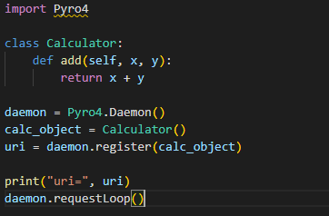
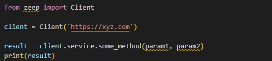

# Section A

1. Give examples of different integration protocols you have come across and give example scripts in python 3 on how to achieve each one.

Integration protocols are a set of guidelines and standards that are used to facilitate communication and data transfer between different systems and applications. I will provide examples and explanations of some of the integration protocols I have come across as well sample scripts for achieving each one.
a)	Representational State Transfer (REST)
REST is a style for building web services that use HTTP requests to POST(create), PUT(update), GET(read) and DELETE(delete) data. REST is often used to build Application Programming Interfaces that allow applications to communicate with each other over the internet. To use REST, you can utilize the ‘requests’ library to handle the communication.

First, the ‘requests’ library is imported. This library provides the functionality used to make HTTP requests. A GET request is made by calling ‘response=requests.get(https://xyz.com). This sends a GET request to the URL that has been specifies and assigns the response to the ‘response’ variable. The status of the response i.e. 404 is printed by calling ‘print(response.status_code)’ The content of the response is then printed by calling ‘print(response.content)’. Next, a POST request is made by calling ‘response=requests.post(https://xyz.com). This sends a POST request to the URL specified and assigns the response to the variable ‘response’.Finally, both the status codes and contents are printed.

b)	Remote Procedure Call(RPC)
This is a protocol that allows a computer program to make a request to a remote service and receive a response. These protocols are used to build distributed systems and are based on the client-server model. The client makes a request to the server and the server returns a response. The most common protocol is TCP. RPC allows for the integration of different systems and programming languages. It allows for one system to call procedures on another system. It is often used in conjunction with other technologies to provide additional functionalities like load balancing. ‘py404’ library is used to handle the RPC communication.
 

The example above is for a calculator class that a method ‘add’ can be called remotely using RPC. The library ‘pyro4’ is used to create a daemon that listens for incoming requests and routes them to the object. The calculator obect is registeres with the daemon and given a unique URI that can be used to access it. In this example, the calculator class has a method ‘add’ that takes two parameters ‘x’ and ‘y’ and returns their sum. Next, an instance of the Pyro4.Daemon class is created. This instance listsens for incoming requests and routes them to the appropriate object. An instance of the calculator class is created and assigned a URI. Finally, the requestLoop ethod is called which starts the loop that listens for ncoming requests and routes them to the appropriate object. The daemon listens for ncoming requests and routes them to the calculator object which allows clients to call the ‘add’ method remotely.

c)	Simple Object Access Protocol(SOAP)
Simple Object Access Protocol (SOAP) is a messaging protocol for exchanging structured data between applications over the internet. It is based on XML and uses STMP or HTTP as the transport protocol. SOAP messages are sent as an HTTP POST request, with the message body containing the SOAP envelope and header. SOAP can be used to connect different systems and applications regardless of the programming languages or systems the use. A key feature of SOAP is that it uses a Web Services Description Language(WSDL) to define the methods and data structures that are available for use. This allows for east and efficient communication between systems. To use SOAP, the ‘zeep’ library can be used to handle the SOAP communication.
 

The ‘zeep’ library is used to connect to a SOAP web service at the URL specifies and the method ‘some_method’ is called with the parameters given. The result of the method call is printed. The zeep library automatically handles the generation of the SOAP message, including creating the correct envelope and header, encoding the data in the body. In the above example, the zeep library is first imported and a new instance of the Client class is created. The URL is then passed for the web service.

2. Give a walkthrough of how you will manage a data streaming application sending one million notifications every hour while giving examples of technologies and configurations you will use to manage load and asynchronous services

Managing a data streaming application that sends one million notifications per hour requires a robust and scalable architecture to handle the high volume of data and manage the load. The key to success is to design a system that can handle the incoming data efficiently and route it to the appropriate services with minimal latency. Below, I will explain how to manage a data streaming application sending one million notifications every hour while giving examples of technologies and configurations used to manage load and asynchronous services. It can be done in the following ways: Data analysis and pipeline design. The first step in managing a data streaming application is to analyze the data stream and understand the structure and format of the notifications. Moreover, understand the targe audience and the delivery method that is desired. The data pipeline should be designed to handle the incoming data and route it to the appropriate services. Moreover, message queue and load balancers can be used. To handle the high volume of data and manage load, a message queue ie. Apache Kafka can be used, These technology allows for asunchronous processing of messages and provides a buffer for handling bursts of traffic. A load balancer such as NGINX can be used to distribute the incoming traffic across multiple servers. Finally, microservers and Serverless Functions. To handle the notifications, a combinations of microservices and serveless functions can be used, Microservices allows for the separation of concerns and make it easier to scale and maintain the different components of the systems. Serverless functions like AWS Lambda can be triggered by events in the message queue and are ideal for handling small tasks.

3. Give examples of different encryption/hashing methods you have come across (one way and two way) and give example scripts in python 3 on how to achieve each one. 

Encryption and hashing are important in computer security. Encryption os the process of concerting plaintext into ciphertext, while hashing is the process of generating a fixed-length output from a variable-length input.
One-way encryptions include:
a)	SHA-256. 
This is a one-way hashing algorithms tha generates a 256-bit hash value from an input. The hashlib library provides and implementation fo SHA-256.

The hashlib library is initially imported. A new SHA-256 hash object is created usin ‘hash_object=hashlib.sha256()’. The input data is hashed.The hexadecimal representation of the hash is retrieved and printed.

b)	bcrypt
This is a password hashing algorithm that is designed to be difficult to crack.

Two way encryption methods include:
a)	AES.
This is a symmetric encryption algorithm that can be used to encrypt and decrypt data. The ‘pycrypto’ library provides an implementation of AES.

The necessary libraries are imported. The input data is specified. The encryption key is passed to the variable ‘key’. A new AES cipher object is created and the data is encrypted using the code ‘ciphertext, tag=cipher.encrypt_and_digest(data)’ To decrypt the data, the following code is used:‘plaintext=cipher.decrypy(ciphertext)’

b)	RSA
This is an asymmetric encryption algorithm that can be used to encrpty and decrypt data. The cryptography library provides implementation of RSA.

 

First, a new RSA key pair is generated using the ‘generate_private_key’ method. Then, we serialize the private and public keys using the ‘private_bytes’ and ‘public_bytes’ methods. Next, the encrypt method is used from the public key to encrypt the input data and the decrypt method from the private key to decrypt the ciphertext.
